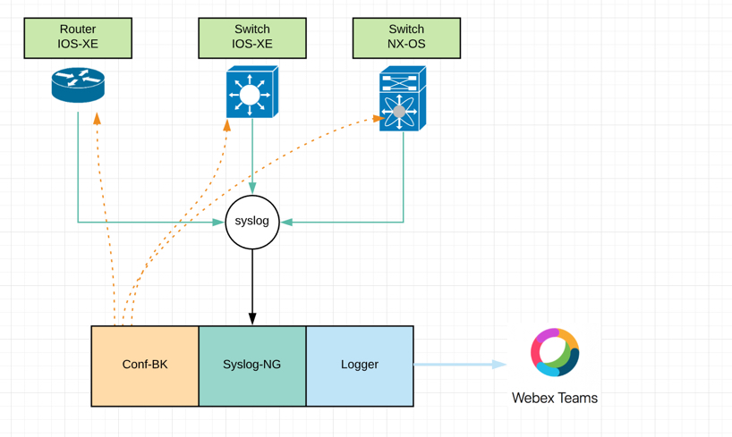

# Cisco Configurations Changes Logger

This tool is compose of three tools working toguether in order to acomplish one goal, wich is to post configurations changes on a Webex Channel

#### Components
  1. Syslog-NG # OpenSource tool to receive syslogs and forward them to other destinations.
  2. Conf_bk # Tool creates linux cron jobs to backup the devices configurations and save them locally on the server.
  3. Logger # Tool that listens for incoming messages containing the message "Configured" and then triggers a workers to check what changed.

The tool takes advantage of the syslog that Cisco network devices send when a config change is done. Below is an example of the syslog that a Cisco IOS-XE device will send when a user goes into configure terminal mode.

*Apr 12 17:02:38.407: %SYS-5-CONFIG_I: Configured from console by console

When the Cisco device sends this logs to the server running this tool it will trigger a python worker to go and check the configurations and comparate with the archive it has on file, afterwards will do a post to Webex Space as the one below.

## Getting Started
    1. [Installation Guide](docs/installation.md)