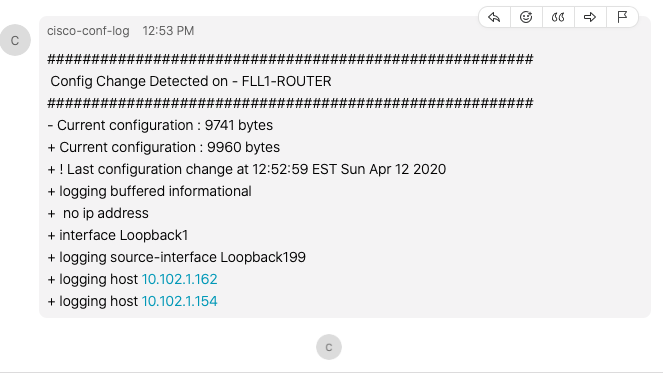

# Cisco Configurations Changes Logger

This tool takes advantage of the syslog that cisco network devices send when a config change is done. Below is an example of the syslog that a Cisco IOS-XE device will send when a user goes into configure terminal mode.

*Apr 12 17:02:38.407: %SYS-5-CONFIG_I: Configured from console by console

When the Cisco device sends this logs to the server running this tool it will trigger a python worker to go and check the configurations and comparate with the archive it has on file, afterwards will do a post to Webex Space as the one below.

## Getting Started
