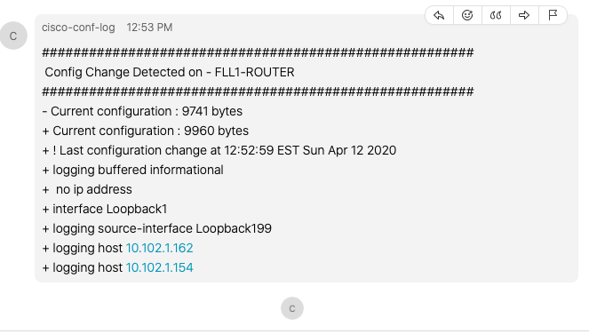

# Installation Guide

### Before you start please note that this needs to be installed on linux distribution Ubuntu 18.04

### 1.The first step is to start by installing git and python3, if your system has it already then ignore this step.
```
sudo apt install git -y
!
sudo apt-get install python3 -y
!
sudo apt-get install python3-pip -y
```

### 2.Once git and python3 are installed please clone the repo into the following directory /opt/
#### This tool must be installed on the lunix directory /opt/

#### Jump into sudo user and do not exit since everything will be installed under the root user.

```
cd /opt/
sudo su
git clone https://github.com/NetDevLazg/cisco-conf-log.git
```

### 3.We will start by updating the environment variables under the file "env_varaibles.py". Please make sure you update the following variables. Don't worry just yet about the WEBEX_WEBHOOK URL.

1. cisco_username
2. cisco_password


### 4.After the env_varibales are updated we will update the "schedules.yml" file with the devices you want to backup the configurations. Please note the configs will be saved on /opt/cisco-conf-log/conf_bk/config_backups/

#### NONE: Please note that the cron time below means it will download the config every 5 minutes. Please adjust accordingly. If your only testing with a few devices then just leave as is and it will download the configs every 5 min.

#### If need help with the cron time you can use this tool: https://crontab-generator.org/
```schedules:
  - site_name: DMVPN
    time: */5 * * * *
    hosts:
       ROUTER-DMVPN-1: 10.199.199.1:cisco_ios

  - site_name: MPLS
    time: */5 * * * *
    hosts:
       MPLS-ROUTER-1: 10.199.199.6:cisco_ios
       MPLS-ROUTER-2: 10.199.199.8:cisco_ios
       MPLS-ROUTER-3: 10.199.199.4:cisco_ios

  - site_name: NXOS
    time: "*/5 * * * *"
    hosts:
       NXOS-SWITCH1: 10.199.199.10:cisco_nxos
```

### 5. Now we will proceed and install some system requirements and python3 library along with the config backup tool.

#### Run the following command:
```
sudo ./conf_bk_setup.sh
```

#### At this point, you need to check that the root cron jobs have been modified and that the system is downloading the device configurations and being saved. To check the root cron jobs use the following command while being under the root user: crontab -l

#### If you set up the tool to backup the configs overnight or on a specific date/time please wait until you see this is working before proceeding.


### 6. At this step, you have confirmed that the tool is backing up the configs at the desired time. So now we will proceed and install the logger. The logger is the one that will trigger a python worker to compare the configs between the device and the backed up configs. On this step, you won't see anything yet because we still need to send syslogs to this server from the devices so do not to worry.

### Let's start by creating a Webex Space, This step I won't demonstrate but if you use Webex and pretty sure you know how to create a space.

#### To create the Webhook go to the below page, once there click on Connect and log in with your creds:
https://apphub.webex.com/teams/applications/incoming-webhooks-cisco-systems

#### Scroll down and give the Webhook a name and assign it to the space created. Below a link will appear and that's the one you need to copy and update the file "env_variables.py"

### 7. To install the logger make sure you are on the directory /op/cisco-conf-log/ then run the following command:
```
sudo ./logger_setup.sh
```

#### After the installation is done you should be able to verify using the following command:
#### By default, the logger listens for messages on port 10000

```
systemctl status cisco-conf-log
```

### 8. Now the time to install the syslog receiver, We will use a tool called syslog-ng. To install the tool please do the following from the directory /op/cisco-conf-log/

```
sudo ./syslog_ng_setup.sh
```

#### This bash script will install the syslog-ng tool and will automatically create a syslog forward for incoming syslog messages on port UDP 514 and UDP 518 for Nexus devices. 

#### NOTE: If you have a firewall enabled on the Ubuntu VM please make sure to allow port 514 UDP and 518 UDP

```
sudo ufw allow 514/udp
sudo ufw allow 518/udp
```

### 9. The last step is now to configure Cisco IOS and Cisco NXOS devices to send syslog information to this new server.

#### Cisco IOS needs to send the syslog on the default port 514/UDP
#### Cisco NXOS needs to send the syslog on port 518/UDP

#### Example: Cisco IOS
### Please note that the IP I am using is of a device in my lab, use your server IP.
```
logging buffered informational
logging source-interface Loopback1
logging host 10.102.1.162
```
#### Example: Cisco NXOS
### Please note that the IP I am using is of a device in my lab, use your server IP.
```
logging source-interface loopback1
logging server 10.102.1.162 6 port 518 use-vrf default
no logging rate-limit # some Nexus' dont support this command anymore
```

#### You can verify that the server is receiving the logs by checking the cisco-conf-log process "systemctl status cisco-conf-log"

#### Below is an example of how the message in WebEx will look.

